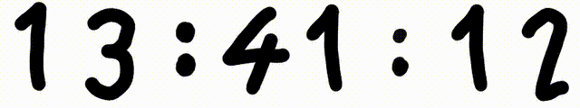
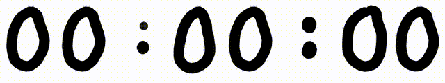
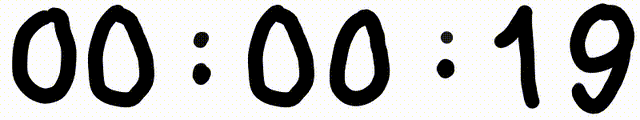

# Clock

A simple clock application written in C++ using SDL2, featuring a hand-drawn font.
Inspired by clock used by [Tsoding](https://www.twitch.tv/tsoding) in his streams

- **Clock:**


- **Timer:**


- **Countdown:**


## Table of Contents

- [Introduction](#introduction)
- [Features](#features)
- [Requirements](#requirements)
- [Build](#build)
- [Usage](#usage)
- [Planned Features](#planned-features)
- [License](#license)

## Introduction

This is a basic clock application built using SDL2. The clock displays the current time using a terrible, hand-drawn font created by me.

## Features

- Displays the current time
- Countdown timer
- Stopwatch timer

## Requirements

To build and run this project, you need the following:

- C++ compiler
- Make
- SDL2
- SDL2_image

## Build
1. **Clone the repository:**
    ```sh
    git clone https://github.com/nyjako/clock.git
    cd clock
    ```
2. **Build the project:**
    ```sh
    make
    ```

## Usage

Run the clock application with the desired mode:

```sh
./Clock <mode> [<duration>]
```

### Modes

- `clock` : Displays the current system time.
    ```sh
    ./Clock clock
    ```

- `countdown <duration>` : Runs a countdown for the specified duration.
    ```sh
    ./Clock countdown 10s 5m 3h
    ```

- `timer` : Runs a stopwatch timer that counts from 0.
    ```sh
    ./Clock timer
    ```

## Planned Features

- [X] Timer function
- [X] Countdown function
    - [X] Countdown with minutes and hours as argument
    - [ ] Play audio when countdown finish

## License

This project is licensed under the MIT License. See the [LICENSE](/LICENSE) file for details.
